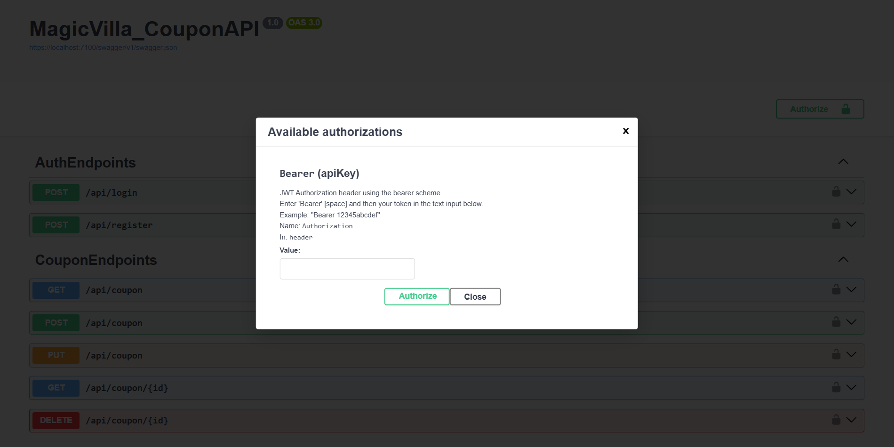

# Minimal API Demo

## Описание

Небольшое приложение для демонстрации Minimal API. Базы данных создаются при помощи миграций. Для этого в окне *Package Manager Console* нужно выполнить команду

```powershell
PM> Update-Database
```

---
 - Используемые технологии: .NET 8.0, ASP.NET Core, Entity Framework Core (Tools, SqlServer)
 - Авториза
---

## REST API

Используется Bearer авторизация с JWT токеном.


